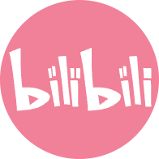

<tr><td>

# 👤 基本信息

- 👨‍💻 CozyOct1
- ⌛ 23岁
- 🏠 浙江杭州

</td></tr>

<tr><td>

# 🏫 教育背景

- [合肥工业大学](https://www.hfut.edu.cn/) &emsp; 🕰️ 2020.09 —— 2024.06

  - 专业：智能科学与技术
  - 学位：本科

- [浙江大学](https://www.zju.edu.cn/) &emsp; 🕰️ 2024.09 —— 2027.06

  - 专业：人工智能
  - 学位：硕士

</td></tr>

<tr><td>

# 🏢 实习经历

- [上海哔哩哔哩股份有限公司](https://www.bilibili.com/) &emsp; 🕰️ 2025-05 —— 2025-08

  - 工作岗位：大模型&AIGC 研发工程师
  - 工作内容：数码推荐智能体

</td></tr>

<tr><td>

# 🔧 专业技能

- 语言：

- 框架：

- 数据库：

- 工具：

</td></tr>